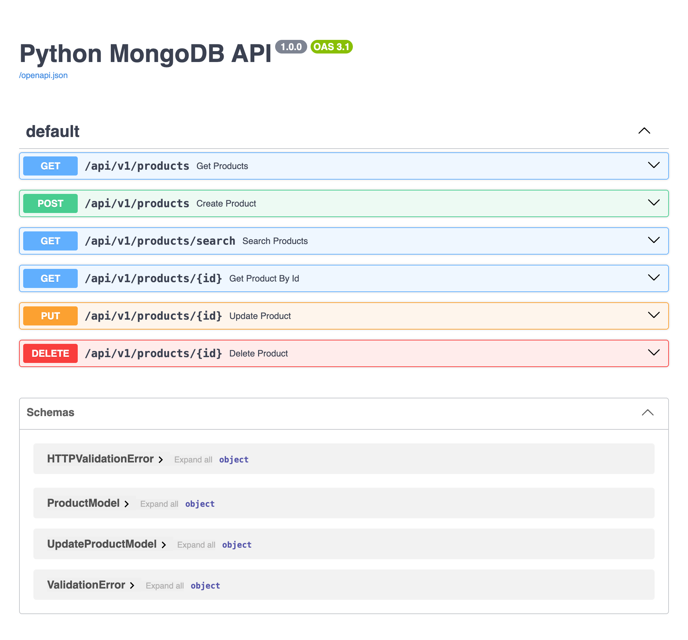

uvicorn main:app --reload

http://127.0.0.1:8000/docs

🏆 Что получилось?
* Инфраструктура: Полноценный Docker-кластер MongoDB из 3 нод с настроенной автоматической репликацией (копии данных синхронизируются сами).
* База данных: Автоматическая NoSQL миграция индексов при старте (составные ключи для шардинга, уникальные slug, вложенные индексы для фильтров и текстовые индексы).
* Бэкенд: Быстрый, асинхронный Python API на FastAPI с полноценным CRUD-функционалом и поиском по релевантности.
* Документация: Автоматически генерируемый Swagger UI, который подхватывает схемы данных. 

endpoints:

